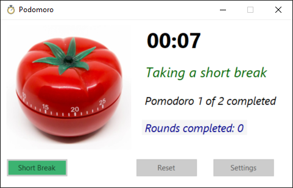
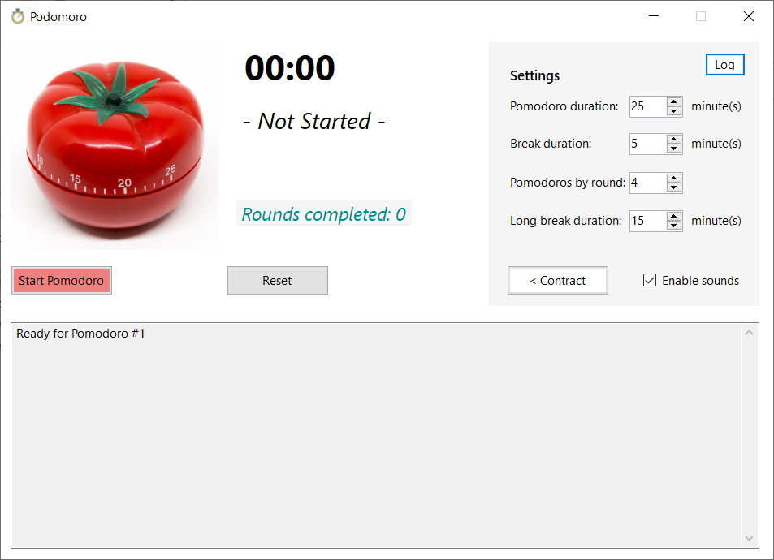

# Pomodoro
Pomodoro Windows Forms App

## Requires
- Visual Studio 2019 Version 16.9
- .NET Core 5.0

## Quick introduction about Pomodoro
The *Pomodoro Technique* suggests you how to be more productive in your tasks.

Using the standard values of this technique, 1 pomodoro is equivalent to 25 minutes focused in a work session, plus 5 minutes break.

When we have completed 4 pomodoros with the breaks, we will take a long break of 20 minutes.

This is the general summary of this technique, but you could adapt it to your needs.

The final objective of this, is to have a lot of pomodoros when we finish our daily work.

> When we start a pomodoro, **is very important** to be **focused** in our pomodoro, so you should not be disturbed.

## About this Application

This Windows Application helps you to manage your pomodoros.

You can change the settings adapting the application as you want.

By default, when you finish a pomodoro, a short break or a long break, you will get a sound in your Windows.

You can disable this option, or change the sound that you will find in the **Sounds** folder overwritting the *wav* files by your favorite sounds.

The app running will have this appearance:

When you start an action (pomodoro, short or long breaks), you can see the progress in the Windows taskbar.

An action in progress is shown as:

In the final progress as:

And when it has finished as:

You can see the *log* about your actions quickly doing click first on the **Settings** button, and in the **Log** button after that.

The app hide some parts of it when you execute an action, but when you are not executing any action, you can access to the Settings and Log without restrictions.

